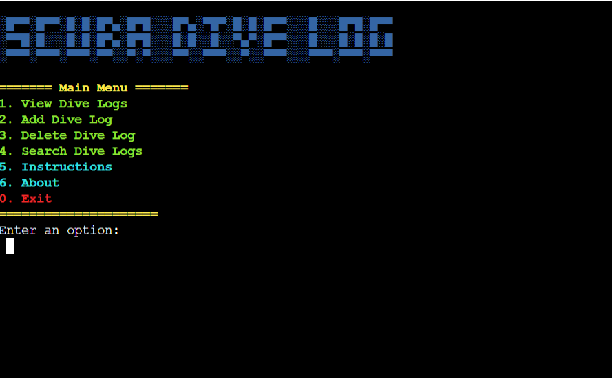
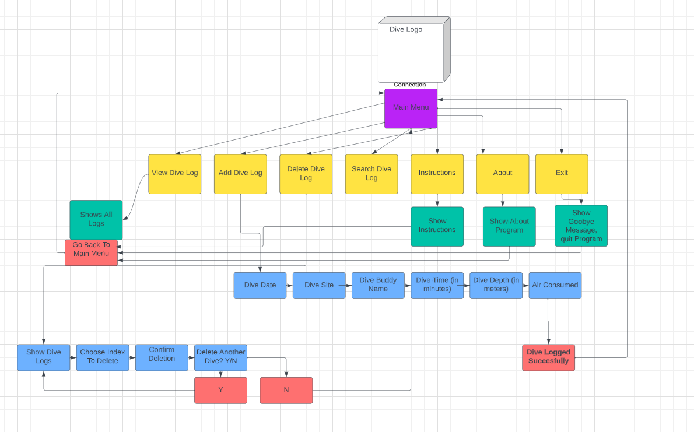
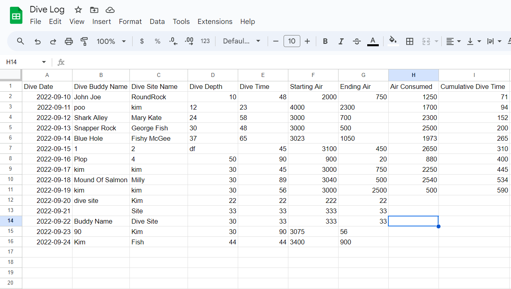
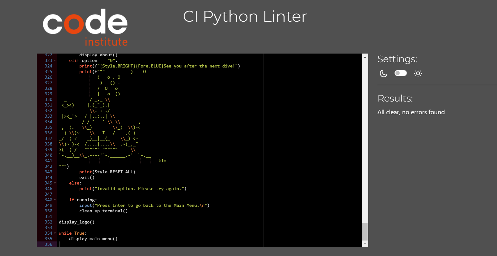

# Scuba Dive Log

*The link to [Scuba Dive Log](https://dive-log-9f66ea37cc55.herokuapp.com/)*

Scuba Dive Log is a Python terminal project designed to log users' scuba dive information. It allows divers to keep track of all their dives by storing useful information such as dive date, dive buddy, dive site name, dive depth (in meters), dive time (in minutes), and air consumed (in PSI or bar).

---

## How to use the program:

1. Click on this *[link](https://dive-log-9f66ea37cc55.herokuapp.com/)* or copy and paste this text: `https://dive-log-9f66ea37cc55.herokuapp.com/` into your browser's address bar.
2. Once the page is loaded, click on 'RUN PROGRAM'.
3. Follow the instructions provided by the program.
4. Choose from various options available, such as viewing dive logs, adding dive logs, deleting dive logs, searching dive logs, reading instructions, learning about the program, or quitting.
5. When you are done, choose "Quit" and **send** the link to this program to your friends!

Link to the program: *[https://dive-log-9f66ea37cc55.herokuapp.com/](https://dive-log-9f66ea37cc55.herokuapp.com/)*

---
## User Stories
### First Time Visitor Goals:

* As a First Time Visitor, I want to quickly understand the purpose of the program so that I can learn more about it.
* As a First Time Visitor, I want to easily navigate through the program to find the content I need.
* As a First Time Visitor, I want to add and store my dive data.
* As a First Time Visitor, I want to find information about the developer and the program.

### Frequent Visitor Goals:
* As a Frequent User, I want to review my previous dive logs.
* As a Frequent User, I want to update my dive experiences and edit old logs.

---

## Features
  
- **When the program is loaded**
  - Users will see a logo and a main menu that explains the purpose of the program:
  
  

  - Shows the terminal menu with seven options:

    1. View Dive Logs;

    2. Add Dive Logs;
    
    3. Delete Dive Logs;

    4. Search Dive Logs;

    5. Instructions;

    6. About;

    7. Quit;

      

- **When the user chooses "View Dive Logs"**
  - The program displays the dive logs.

- **When the user chooses "Add Dive Log"**
  - The program shows a sub-menu with options to add various types of dive logs.

- **When the user chooses "Delete Dive Log"**
  - The program asks for the log's ID to delete it.

- **When the user chooses "Search Dive Logs"**
  - The program asks for specific criteria to search for dive logs.

- **When the user chooses "Instructions"**
  - The program displays instructions on how to use it.

- **When the user chooses "About"**
  - The program provides information about the program and the developer.

- **When the user chooses "Quit"**
  - The program shows a goodbye message and stops.

---

---

## Flowchart

The flowchart below represents the logic of the Scuba Dive Log application:

## Database Structure

The Scuba Dive Log application uses Google Sheets to store and retrieve data. The application has one worksheet named "DiveLog" that stores all the data.

The worksheet consists of seven columns: Dive Date, Dive Buddy, Dive Site Name, Dive Depth, Dive Time, Starting Air, and Ending Air. This structure allows the program to store and retrieve dive log data from the Google Sheets spreadsheet.
  

The ID column value is assigned automatically when a new divelog is added.

---
## Technologies Used

### Languages:

- [Python 3.8.5](https://www.python.org/downloads/release/python-385/): used to anchor the project and direct all application behavior

- [JavaScript](https://www.javascript.com/): used to provide the start script needed to run the Code Institute mock terminal in the browser

- [HTML](https://developer.mozilla.org/en-US/docs/Web/HTML) used to construct the elements involved in building the mock terminal in the browser

### Frameworks/Libraries, Programmes and Tools:
#### Python modules/packages:

##### Standard library imports:

- [datetime](https://docs.python.org/3/library/datetime.html) The datetime module supplies classes for manipulating dates and times.
- [os](https://docs.python.org/3/library/os.html) was used to clear the terminal before running the program.

- [copy](https://docs.python.org/3/library/copy.html) The copy module is used in the delete_dive_log() function. The copy.copy() function is used to create a shallow copy of the dive log list obtained from the Google Sheets spreadsheet. This allows the function to update the list of dive logs after deleting a log without modifying the original list.

##### Third-party imports:

- [NLTK Package](https://www.nltk.org/) was used in order to be able to work with pattern package.
- [Pattern Package](https://stackabuse.com/python-for-nlp-introduction-to-the-pattern-library/) was used to pluralize nouns where it is needed.
- [Simple Terminal Menu](https://pypi.org/project/simple-term-menu/) was used to implement the menu.
- [Colorama](https://pypi.org/project/colorama/) was used to add colors and styles to the project.

#### Other tools:

- [VSCode](https://code.visualstudio.com/) was used as the main tool to write and edit code.
- [Git](https://git-scm.com/) was used for the version control of the website.
- [GitHub](https://github.com/) was used to host the code of the website.
- [SnippingTool](https://snippingtoolfree.com/) was used to capture images for the README file.
- [Lucid Flow Chart](https://www.lucidchart.com/) was used to make a flowchart for the README file.
- [heroku.com](https://heroku.com/) was used to deploy the project.

---

---
## Testing

Please refer to the [TESTING.md](TESTING.md) file for all test related documentation.

---
## Validation 

### PEP8

[PEP8CI](https://pep8ci.herokuapp.com/) app was used to lint the code.
It was helpful to edit with then copy the fixed code back into VS Code.
After a ropey start with many errors that gave me a fright initially, I got it down to no errors without too much hardship.

#   Deployment

## Git and GitHub

1. [Code Institute template](https://github.com/Code-Institute-Org/python-essentials-template) was used to create GitHub public 
repository [divelog](https://github.com/kimatron/divelog). In template repository clicked on "use this template" --> "create new repository", 
choose repository name and clicked on the green button "Create repository from template".

2. Clone repository to your local machine using GitHub.
3. Use the following commands to add, commit and push changes:
    - git add .
    - git commit -m "Do something"
    - git push
    Also:
    - clear (to clear the terminal)
    - git status (to know if your app is up to date and your working tree is clean)

4. Ensure that all libraries and packages are listed in requirements.txt file.

5. When program is ready for further deployment, visit heroku.com website to deploy on heroku.

## Deployment to Heroku

1. Navigate to [https://heroku.com/](https://heroku.com/) and open dashboard. Then  click the button "New" and select "Create new app" button.

2. Enter app name, chose region, and click on "Create app" button

3. The next step was to go to "Deploy" tab and then to "Deployment method" section to authorize and connect your GitHub account.

4. Upon succesfull connection select main branch from repository.

5. Then go to "Settings" tab.

6. Next go to "Buildpacks" section. Add python and nodejs buildpacks. Order here is very important.

7. Next go to "Config Vars" section and add KEY "CREDS" - that maches your token name defined in python constant
 in [api/google_sheets_api.py] with value of your credentials token (copy all and paste).

8. Add key "PORT" with value "8080" and save changes.

6. Go back to "Deploy" tab (I and decided to use automatic deploys), however manual mode is also available to deploy chosen branch. 

7. The link to my deployed app was shown on screen: https://pp3-home-library.herokuapp.com/

---
## Credits
- Used [Code Institute](https://github.com/Code-Institute-Org/python-essentials-template) template to start off project.
- Sourced some style code ideas for adjusting photo size and layout from various sources online:
[w3schools](www.w3schools.com),
[Stackoverflow](Stackoverflow.com),
[FreeCodeCamp](www.freecodecamp.org).
- Rewatched Love Sandwiches project from [Code Institute](www.codeinstitute.com) for inspiration on how to start setting up my site
- Used [TextKool](https://textkool.com/) to create Dive Log logo with Ascii generator.
- 

### Acknowledgments
- Thanks to Viola for keeping me sane and providing advice at silly o clock in the morning when my eyes weren't working anymore and joining me for a hackathon in the middle of the project, as if we didn't have enough to keep us awake at night :)
- And thanks to my mentor [Juliia](https://github.com/IuliiaKonovalova) for not ignoring me and jumping in to answer all my annoying questions whenever she was asked :)  
 