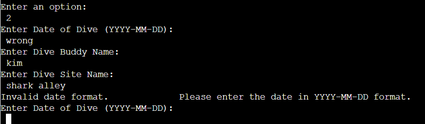
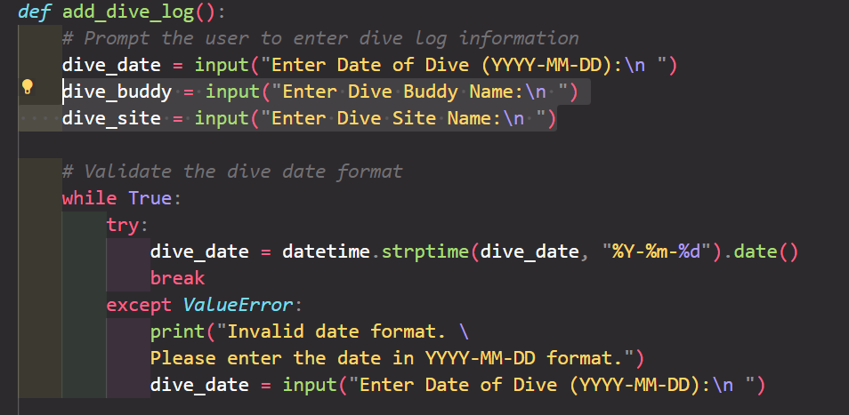
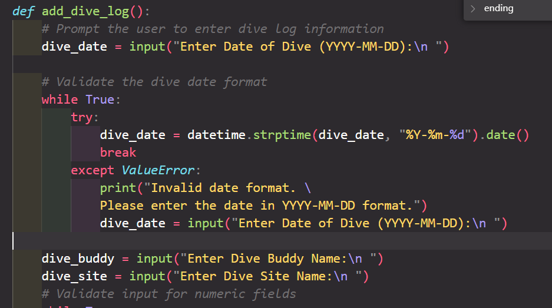
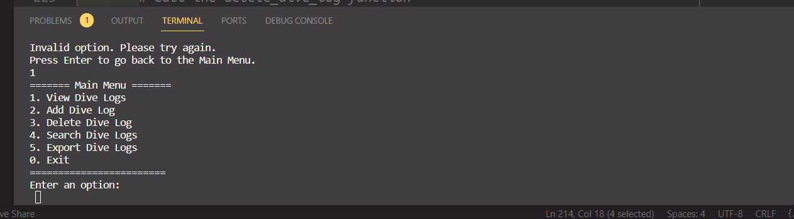
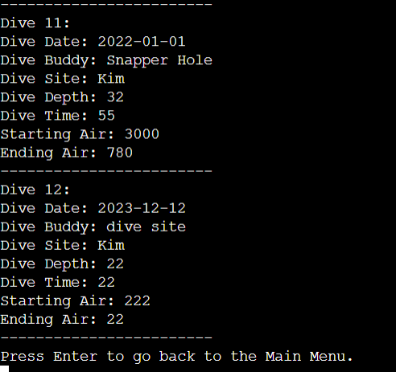
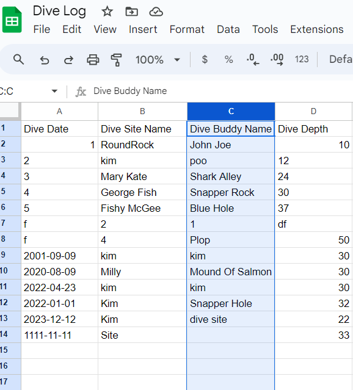
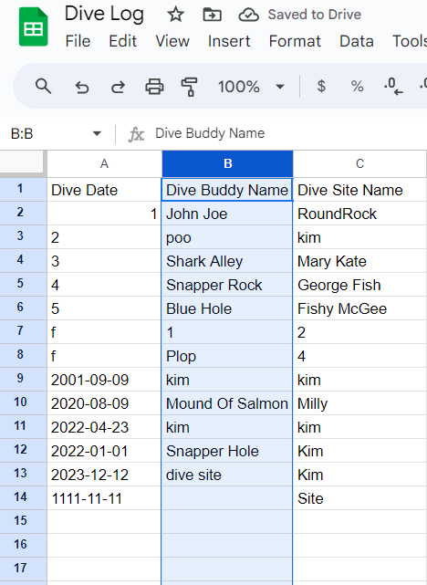
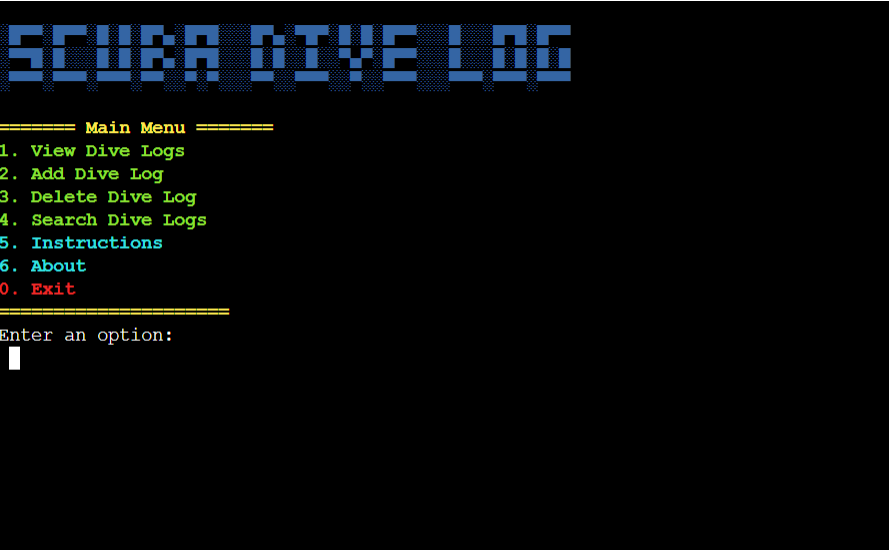

## Bugs

+ **Solved bugs**

When adding an invalid date the incorrect input wasn't notified until after three questions.

After pulling my hair out for about 28minutes I found the simple issue was I was calling three questions before validating the first one

Moving the 2nd and 3rd input below the date validation fixed the problem

- When trying to quit the program I encountered my first real life neverending infinity bug:

Adding a simple exit() call fixed the problem.

- When adding a new dive, input called to enter Dive Buddy Name then Dive Site Name, but when entered correctly and calling on the view dive log functions, the information was recalled in the wrong order.

Looking at the spreadsheet I noticed the titles were in the wrong order, so just switching columns fixed the issue:

# Manual testing of validation and functionalities

Testing of application functionalities and validations were done throughout the building process.

## Main menu

Function used for inputs validation - def display_main_menu()

| What is being tested | Input  | Expected response | Result  |
|---|---|---|---|
|  Please select a number from 0 to 6 to continue | "any number not 0-6", "abc", "empty"   |Wrong input | Pass
|  Please select a number from 0 to 6 to continue | "1" | Valid input, call view_dive_logs fn  | Pass
|  Please select a number from 0 to 6 to continue | "2" | Valid input, call add_dive_log fn | Pass
|  Please select a number from 0 to 6 to continue | "3" | Valid input, call delete_dive_log fn | Pass
|  Please select a number from 0 to 6 to continue | "4" | Valid input, call search_dive_logs fn  | Pass
|  Please select a number from 0 to 6 to continue | "5" | Valid input, call display_instructions fn | Pass
|  Please select a number from 0 to 6 to continue | "6" | Valid input, call display_about fn | Pass
|  Please select a number from 0 to 6 to continue | "0" | Valid input, call quit fn | Pass

# View Dive Logs function

|  What is being tested  | Input  | Expected response  | Result
|---|---|---|---|
|  Dive Logs Pulled From Spreadsheet | "6" (5 records exist)  | Wrong input, please select ID from 1 to 5  | Pass
|  Which book would you like to edit? | "g", empty (5 records exist)  | Wrong input, please select ID from 1 to 5  | Pass
|  Which book would you like to edit? | "5" (5 records exist )  | Input valid, show book #5  | Pass
|  What do you want to edit? Select 1-6 | "0", "a", "`", empty (6 possible choices )  | Wrong input | Pass
|  What do you want to edit? Select 1-6 | "7" (6 possible choices )  | Wrong input | Pass

The same validation method is used for input of author, title, category, status and description for both "add book" and "update book" features.

## Add dive log function

Function used - add_dive_log() 

The function is used to validate Dive Date, Dive Buddy Name, Dive Site Name, Dive Depth (in metres), Dive Time (in minutes), Dive Starting Air (in PSI) and Dive Ending Air (in PSI). Dive Time, Dive Depth, Dive Starting Air and Dive Ending air all require integer inputs.

|  What is being tested  | Input  | Expected response  | Result
|---|---|---|---|
|  Please enter book's title | "a"  | Input too short  | Pass
|  Please enter book's title | "ab"  | Input too short  | Pass
|  Please enter book's title | empty  | Input can't be empty  | Pass
|  Please enter book's title | "!title"  | Input can't start with special char.  | Pass
|  Please enter book's title | "Book title should have a maximum 24 characters "  | Input exceeded 24 characters  | pass
|  Please enter book's title | "Epic"  | Valid input  | Pass
|  Please select "1" if you read that book or "2 if you didn't | "3"  | Wrong input  | Pass
|  Please select "1" if you read that book or "2 if you didn't | empty  | Wrong input  | Pass
|  Please select "1" if you read that book or "2 if you didn't | "0"  | Wrong input  | Pass

## Yes/No question

Function used for inputs validation - validate_yes_no().

|  What is being tested  | Input  | Expected response  | Result
|---|---|---|---|
|  Confirm adding this book. Y/N | "0", "3", "f", empty  | Wrong input  | Pass
|  Confirm adding this book. Y/N |  "y", "Y" | Valid input, proceed | Pass
|  Confirm adding this book. Y/N |  "n", "N" | Valid input, abort  | Pass

## Remove book function

|  What is being tested  | Input  | Expected response  | Result
|---|---|---|---|
|  Please select a book to remove (#ID) | "0", "a", empty (5 records exist) | Wrong input | Pass
|  Are you sure you want to delete this book? Y/N | "0", "b", empty | Wrong input | Pass
|  Are you sure you want to delete this book? Y/N | "n" | Valid input, return | Pass
|  Are you sure you want to delete this book? Y/N | "Y" | Valid input, remove book | Pass

## Show book details function

Function used for inputs validation - validate_num_range()

|  What is being tested  | Input  | Expected response  | Result
|---|---|---|---|
| Which book details would you like to see? | "9" (10 records exist)  | Wrong input  | Pass
| Which book details would you like to see? | "5"  | Valid input, show book details  | Pass
| Which book details would you like to see? | "abc", "!"  | Wrong input              | Pass
| Which book details would you like to see? | "2", | Valid input                     | Pass

## Search Book function

|  What is being tested  | Input  | Expected response  | Result
|---|---|---|---|
| If you wish to search by book title,press 1: | "0"  | Wrong input  | Pass
|If you wish to search by book author, press 2:| "2"  | Valid input  | Pass
|Please enter book's title:                    |"Matilda"| Valid input | Pass
|Please enter book's title:                    | "12"    | Wrong input | Pass
|Please enter author's name:                   | "12"    | Wrong input | Pass
|Please enter author's name:                   | "Dahl"    | Valid input | Pass

# Exit function

|  What is being tested  | Input  | Expected response                         | Result
|---|---|---|---|
| Are you sure you want to quit? | "n"  | Valid input, return  to main menu   | Pass
| Are you sure you want to quit? | "01", "!", empty | Wrong input             | Pass
| Are you sure you want to quit? | "y"  | Valid input, terminate program      | Pass